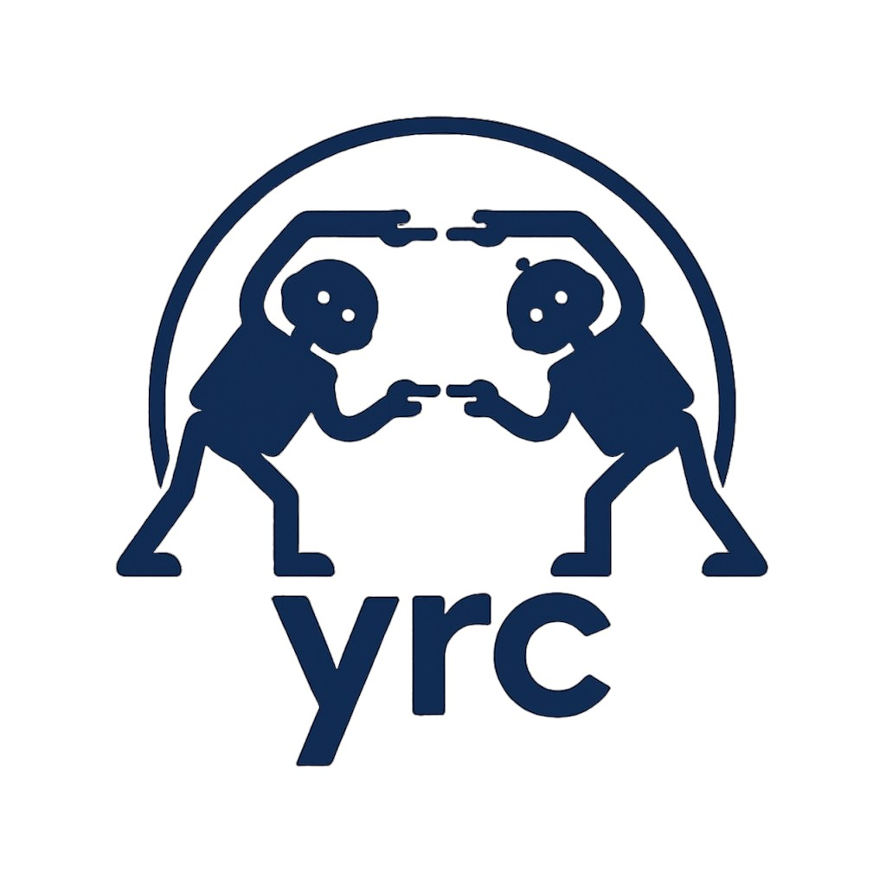

# YRC: Yield or Request Control

<p align="center">
  
</p>

YRC is a research framework for studying **when and how AI agents should request or yield control** to humans or other agents during decision-making. It provides modular abstractions, benchmark environments, and baseline implementations to help you evaluate coordination strategies in multi-agent and human-AI systems.

> “Know when to ask, know when to act.”

---

## 🔧 Features

- ⚙️ Unified abstractions for coordination policies, decision-making agents, and environments.
- 🧪 Benchmark suite of gridworld and visual decision-making tasks (e.g., MiniGrid, Procgen).
- 📈 Baselines: uncertainty-based and reinforcement learning.
- 🧩 Compositional design: Easily add your own policies, algorithms, or environments.
- 📚 Extensive documentation and examples for rapid experimentation.

---

## 📦 Installation

Install from PyPI:

```bash
pip install yrc
```

Or install from source:

```bash
git clone --recurse-submodules https://github.com/khanhptnk/yrc.git
cd yrc
pip install -e .
```

---

## 📚 Documentation

See the full documentation at:
[https://yrc.readthedocs.io](https://yrc.readthedocs.io)

---

## 🧪 Citing YRC


If you use the YRC package in your research, please cite:

```bibtex
@misc{yrc2025,
  author       = {Khanh Nguyen and Mohamad Danesh},
  title        = {YRC: Yield or Request Control},
  year         = {2025},
  howpublished = {\url{https://github.com/khanhptnk/yrc}},
  note         = {Python package. Version 1.0},
}
```

If you want to reference to the YRC-0 problem, please cite our paper:

```bibtex
@article{danesh2025learning,
  title={Learning to Coordinate with Experts},
  author={Danesh, Mohamad H and Trinh, Tu and Plaut, Benjamin and Khanh, Nguyen X},
  journal={arXiv preprint arXiv:2502.09583},
  year={2025}
}
```

---

## 🤝 Contributing

We welcome pull requests, feature suggestions, and bug reports!
Please see [CONTRIBUTING.md](CONTRIBUTING.md) for guidelines.

---

## 🛡 License

This project is licensed under the MIT License.
See [LICENSE](LICENSE) for more details.

---

## 🙏 Acknowledgments

YRC is developed at **UC Berkeley**, and inspired by foundational ideas in cognitive science, control theory, and cooperative AI.
We thank the broader research community and reviewers for helpful discussions and feedback.


