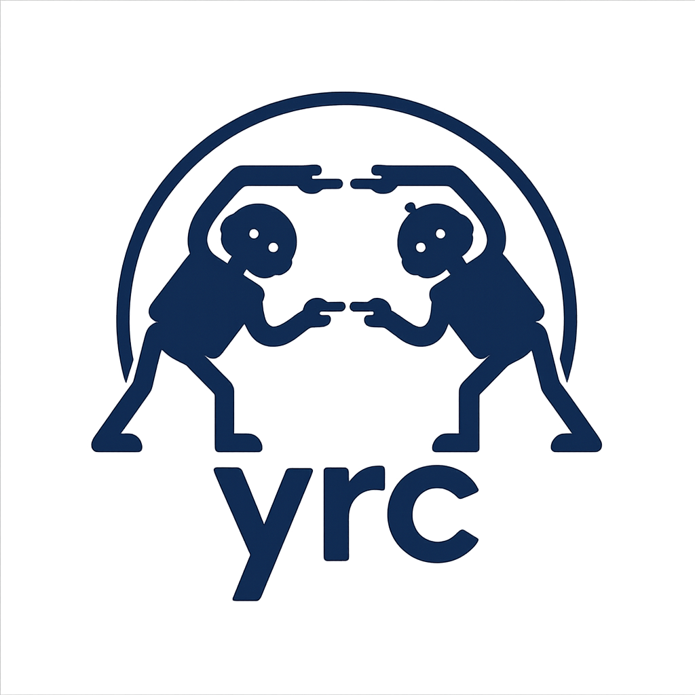

Welcome to yrc's Documentation!
===============================

Humans have evolved a `dual cognitive system <https://en.wikipedia.org/wiki/Thinking,_Fast_and_Slow>`_: a fast, reactive “System 1” and a slow, logical “System 2.” This architecture makes human decision-making both robust and efficient. Robustness comes from System 2’s ability to intervene and prevent mistakes that could be made by the impulsive System 1. Efficiency arises because System 2 can delegate routine tasks to System 1, which operates much faster and with greater energy efficiency.

To build a similar architecture for AI agents, we must address a fundamental problem: *When should each system control the decision-making process?* We call this the **Yield-or-Request Control (YRC)** problem. We have developed a package that provides experimental infrastructure for research on this problem. Our package is simple and extensible—within just a few lines of code, you can train coordination policies on a wide range of environments, using either existing methods or your own.

We believe dual-system agents are the future of AI. You can help shape that future by working on YRC problems now, using our package!

.. toctree::
   :maxdepth: 2
   :hidden:

   Quickstart <quickstart>
   Core concepts <core_concepts/index>
   Tutorials <tutorials/index>
   Algorithms <algorithms/index>
   API reference <autoapi/index>

Getting Started
---------------

- **If you're new to yrc:** Start with the :doc:`Quickstart <quickstart>` guide to get up and running quickly.
- **Explore core ideas:** The :doc:`Core concepts <core_concepts/index>` section introduces yrc’s fundamental abstractions and design philosophy.
- **Try tutorials:** Visit :doc:`Tutorials <tutorials/index>` for step-by-step examples covering common use cases, from custom environments to new algorithms.
- **See what’s included:** The :doc:`Algorithms <algorithms/index>` page lists the standard algorithms provided in yrc and how to use them.
- **Full API documentation:** Dive into :doc:`API reference <autoapi/index>` for details on classes, methods, and configuration options.

About yrc
---------

- **Open-source** and built for extensibility.
- Designed for both **practitioners** and **researchers** in RL, imitation learning, and human-AI collaboration.
- Actively developed and used in academic and industrial research.

Indices and Tables
==================

* :ref:`genindex`
* :ref:`modindex`
* :ref:`search`

