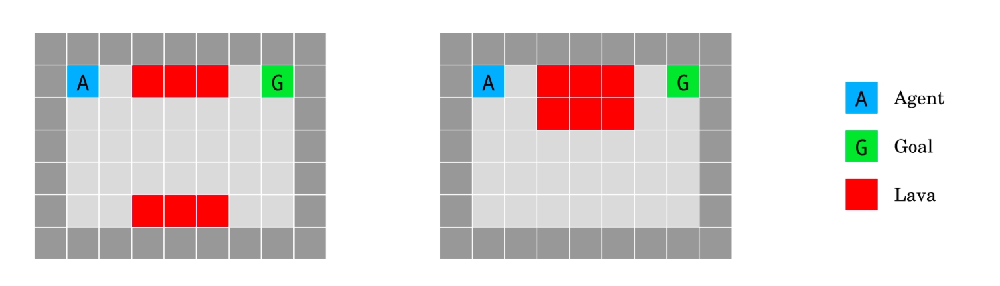

Add a New Environment
=====================

YRC works with any environment that can be cast as a Stable Baselines3 (SB3) environment.  
This includes both Gym and Gymnasium environments.

In this tutorial, you will learn how to:

- Add a Gymnasium environment (MiniGrid) to YRC 
- Add a custom policy model 
- Train a new policy on the new environment using PPO 

.. _add-env:

1. Add a New Gym Environment
----------------------------

We will use the MiniGrid environments ``DistShift1-v0`` and ``DistShift2-v0``.  
``DistShift1-v0`` will be used to train the novice agent, and ``DistShift2-v0`` for the expert agent.  
We will then train a coordination policy on ``DistShift2-v0`` to coordinate both agents.

The DistShift environments come from the paper `AI Safety Gridworlds <https://arxiv.org/abs/1711.09883>`_ (Leike et al., 2017).  
The task is to reach the goal location while avoiding deadly lava. The agent always starts at the top-left corner, and the goal is at the top-right corner.  
The lava is distributed differently in the two variants. Episode returns are between 0 and 1.

   DistShift1-v0 (left) and DistShift2-v0 (right).  
   Source: Leike et al., 2017

1.1. Define and Register Environment Configuration
~~~~~~~~~~~~~~~~~~~~~~~~~~~~~~~~~~~~~~~~~~~~~~~~~

By defining an environment configuration dataclass, you can customize the environment using YAML or command-line flags.

Here is a simple configuration class that lets you set the number of parallel environments and choose the training and test tasks::

    @dataclass
    class MiniGridConfig:
        name: str = "minigrid"
        num_envs: int = 8
        seed: int = 0
        train: Optional[str] = "DistShift2-v0"
        test_easy: Optional[str] = "DistShift1-v0"
        test_hard: Optional[str] = "DistShift2-v0"

Register this configuration class with YRC::

    yrc.register_environment(MiniGridConfig.name, MiniGridConfig)

Once registered, you can override the default parameters using YAML or command-line flags.  
For example, specify ``env.num_env=8`` or ``env.train=DistShift1-v0`` on the command line.

.. note::

   Registration must happen before creating the ``config`` object, so the configuration parser includes the class arguments.

1.2. Convert a Gymnasium Environment to Stable Baselines3
~~~~~~~~~~~~~~~~~~~~~~~~~~~~~~~~~~~~~~~~~~~~~~~~~~~~~~~~~

YRC's PPOAlgorithm expects SB3 environments with these features  
(see the `SB3 documentation <https://stable-baselines3.readthedocs.io/en/master/guide/vec_envs.html#vecenv-api-vs-gym-api>`_):

- The environment resets automatically when an episode ends or is truncated. The returned observation at that time is the first observation of the next episode.
- The ``reset()`` method returns only an observation.
- The ``step()`` method returns a tuple ``(obs, reward, done, info)`` (the original Gym API).

Below is sample code to convert a MiniGrid (Gymnasium) environment to an SB3 environment::

    import gymnasium as gym
    from minigrid.wrappers import ImgObsWrapper
    from stable_baselines3.common.env_util import make_vec_env

    def make_base_env(config, split, render_mode="rgb_array"):
        # config is an instance of MiniGridConfig
        env_id = f"MiniGrid-{getattr(config, split)}"

        # env_fn returns a new environment instance
        def env_fn(env_id=env_id, render_mode=render_mode):
            return ImgObsWrapper(gym.make(env_id, render_mode=render_mode))

        return make_vec_env(env_fn, n_envs=config.num_envs, seed=config.seed)

.. _add-model:

2. Add a New Policy Model
-------------------------

We need a custom model to process observations from the new environment.

As with the environment, you can change the model architecture using YAML or command-line flags.  
This is done by defining a configuration dataclass and registering it with YRC.

Here is an example model for the novice, expert, and coordination policies::

    @dataclass
    class MiniGridPPOModelConfig:
        name: str = "minigrid_ppo"

    class MiniGridPPOModel(nn.Module):
        config_cls = MiniGridPPOModelConfig

        def __init__(self, config, env):
            # some code
            # The model must have these attributes for CoordEnv:
            self.hidden_dim = 128
            self.logit_dim = env.action_space.n

        def forward(self, obs):
            # some code

    # Register model class with YRC 
    yrc.register_model("minigrid_ppo", MiniGridPPOModel)

.. note::

   The model class must have a ``config_cls`` attribute that points to the configuration dataclass.  
   The ``CoordEnv`` (used for training the coordination policy) also requires the model to have ``hidden_dim`` and ``logit_dim`` attributes.

.. _run-experiments:

3. Run Experiments
------------------

We are now ready to train a coordination policy to help the novice efficiently leverage assistance from the expert on ``DistShift2-v0``.

First, create a config YAML file and put it in a ``configs/`` directory:

.. code-block:: yaml

    name: "minigrid_ppo"
    seed: 10

    env: "minigrid"

    policy:
      name: "ppo"
      model: "minigrid_ppo"

    algorithm:
      name: "ppo"
      log_freq: 10
      save_freq: 0
      num_steps: 512
      total_timesteps: 500000
      update_epochs: 4
      gamma: 0.99
      gae_lambda: 0.95
      num_minibatches: 8
      clip_coef: 0.2
      norm_adv: true
      clip_vloss: true
      vf_coef: 0.5
      ent_coef: 0.01
      max_grad_norm: 0.5
      learning_rate: 0.00025
      critic_pretrain_steps: 0
      anneal_lr: false
      log_action_id: 1

    evaluation:
      num_episodes: 32
      max_num_steps: 50
      temperature: 1.0
      log_action_id: 1

    train_novice: "experiments/minigrid_novice/best_test_easy.ckpt"
    train_expert: "experiments/minigrid_expert/best_test_hard.ckpt"

**Train and evaluate the novice:**

.. code-block:: bash

    python -u examples/minigrid_yrc.py \
        --config configs/minigrid_ppo.yaml \
        --mode train \
        --type agent \
        overwrite=1 \
        name=minigrid_novice \
        env.name=minigrid \
        env.train=DistShift1-v0

Example output::

    [0:02:08 INFO]: BEST test_easy so far
    [0:02:08 INFO]:    Steps:         549
       Episode length: mean   17.16  min   17.00  max   18.00
       Reward:         mean 0.94 ± 0.00
       Base Reward:    mean 0.00 ± 0.00
       Action 1 fraction:    0.06

    [0:02:08 INFO]: BEST test_hard so far
    [0:02:08 INFO]:    Steps:         1096
       Episode length: mean   34.25  min    2.00  max   50.00
       Reward:         mean 0.00 ± 0.00
       Base Reward:    mean 0.00 ± 0.00
       Action 1 fraction:    0.15

As expected, the novice, trained on ``DistShift1-v0``, performs poorly on ``DistShift2-v0``.  
It either gets confused or moves straight into the bottom lava pool.

**Train and evaluate the expert:**

.. code-block:: bash

    python -u examples/minigrid_yrc.py \
        --config configs/minigrid_ppo.yaml \
        --mode train \
        --type agent \
        overwrite=1 \
        name=minigrid_expert \
        env.name=minigrid \
        env.train=DistShift2-v0

Example output::

    [0:01:53 INFO]: BEST test_easy so far
    [0:01:53 INFO]:    Steps:         587
       Episode length: mean   18.34  min   15.00  max   32.00
       Reward:         mean 0.93 ± 0.00
       Base Reward:    mean 0.00 ± 0.00
       Action 1 fraction:    0.07

    [0:01:53 INFO]: BEST test_hard so far
    [0:01:53 INFO]:    Steps:         634
       Episode length: mean   19.81  min   19.00  max   24.00
       Reward:         mean 0.93 ± 0.00
       Base Reward:    mean 0.00 ± 0.00
       Action 1 fraction:    0.10

The expert, trained on ``DistShift2-v0``, performs well on both variants.

**Train the coordination policy:**

.. code-block:: bash

    GYM_BACKEND=gymnasium python -u examples/minigrid_yrc.py \
        --config configs/minigrid_ppo.yaml \
        --mode train \
        --type coord \
        overwrite=1 \
        name=minigrid_coord \
        env.name=minigrid \
        env.train=DistShift2-v0 \
        device=2

.. note::

   When training the coordination policy, you must set the ``GYM_BACKEND=gymnasium`` environment variable so that YRC can initialize the CoordEnv correctly.  
   This is only needed for the coordination policy.

Example output::

    [0:05:42 INFO]: BEST test_easy so far
    [0:05:42 INFO]:    Steps:         571
       Episode length: mean   17.84  min   15.00  max   20.00
       Reward:         mean 0.84 ± 0.02
       Base Reward:    mean 0.94 ± 0.00
       Action 1 fraction:    0.27

    [0:05:42 INFO]: BEST test_hard so far
    [0:05:42 INFO]:    Steps:         656
       Episode length: mean   20.50  min   19.00  max   25.00
       Reward:         mean 0.74 ± 0.01
       Base Reward:    mean 0.93 ± 0.00
       Action 1 fraction:    0.46

The learned coordination policy enables the novice to request help only 46% of the time while achieving expert-level performance (0.93) on ``DistShift2-v0``.

